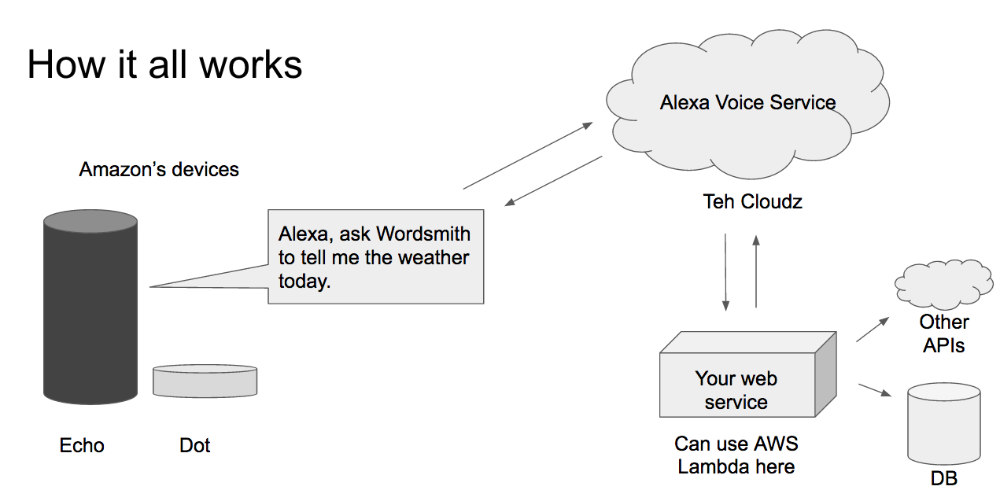

# Alexa Whiskey Advisor

This project contains a sample project that shows how easy it is to use the Alexa service and AWS Lambda to create an Alexa skill. Basically, if you can write a Python function (or Node or C#, I guess), you can make a skill.

## Overview

The architecture of a skill looks something like this:



The physical Echo/Dot device is really nothing more than a speaker, microphone, and wifi transmitter. The speaker listens constantly for the "Alexa" keyword. When it hears someone say "Alexa", it begins listening to what they say. A single statement is called an utterance. Each utterance should contain several parts:

- "Alexa" start word
- The invocation name of the skill you want to use
- The intent to pass to the skill
- "Slot" data that contextualizes the intent.

With the whiskey advisor, we will create a skill with the invocation name "whiskey advisor". We will then create a single intent, "GetReview", that can be invoked by saying things like "tell me about {some whiskey}" or "how is {some whiskey}". Putting it all together, a sample utterance might be: "Alexa, ask whiskey advisor to tell me about Talisker 10." In this case, "whiskey advisor" is the invocation name, "tell me about" defines the intent of the question, and "Talisker 10" is a wildcard slot that is filled with the particular whiskey you want to hear about.

Once the devices captures an utterance, it sends the raw audio file to the Alexa cloud service. This is where much of the magic happens - the service automatically translates the audio into text data, parses out the intent (if any valid one was provided), and extracts the values for the slot variables. In the case of the utterance above, the output from the Alexa service is json that looks like this:

```
{
  "session": {
    "sessionId": "XXXXXXXXXXXX",
    "application": {
      "applicationId": "XXXXXXXXXXXX"
    },
    "attributes": {},
    "user": {
      "userId": "XXXXXXXXXXXX"
    },
    "new": true
  },
  "request": {
    "type": "IntentRequest",
    "requestId": "1234567890",
    "locale": "en-US",
    "timestamp": "2017-02-04T19:13:58Z",
    "intent": {
      "name": "GetReview",
      "slots": {
        "dram": {
          "name": "dram",
          "value": "Talisker 10"
        }
      }
    }
  },
  "version": "1.0"
}
```

This response provides some metadata about the request, but more importantly, tells us that the user's intent was `GetReview`, and that a slot called `dram` in that intent was filled with `Talisker 10`. Now what we need to do is build a custom web service that consumes this json data and spits out the text for Alexa to recite back. In this case, we would want the text to be: "The Talisker 10 is a respectable dram, with an average rating of 87. It's also an average-priced bottle at $59 for a fifth."

## The Python code

Now that we know roughly what the Alexa response object looks like, we can write some Python code to handle it and create some text for Alexa to respond with.

The entry point to the code is `lambda_function.lambda_handler`. This function takes the json above and pulls out the intent name and slot values. Then, it looks up the data corresponding to the dram and issues a json response with some text describing that dram.

The data in `whiskey_data.json` is from the [reddit Whiskey Archive](https://docs.google.com/spreadsheets/d/1X1HTxkI6SqsdpNSkSSivMzpxNT-oeTbjFFDdEkXD30o/edit#gid=695409533), a big shared spreadsheet of review data from a number of whiskey subreddits like /r/scotch and /r/bourbon. I grabbed this data, cleaned it up a bit, and saved it into json format. Instead of making calls to an outside database to get info about the whiskey, we'll just package this json with our source code and ship it to our service.

Next, we'll build the lambda service that will run this Python code. One important thing to note first, though - our Lambda will run a bare installation of Python 2.7. In other words, you have access to the standard library (plus [boto3](https://boto3.readthedocs.io/en/latest/) for interacting with other AWS resources), but that's it. You can't `pip install` packages. If you write code with dependencies on other PyPI packages, you'll either need to ship the entire dependency with your code or find a way to live without them.

## Building the Lambda service

We'll use AWS Lambda to create the service that builds our output responses. Lambda is AWS's serverless architecture platform - basically, you load a simple script into the service, and whenever the service endpoint is hit, your script is run against the input data. For small projects, this can be quite a bit cheaper and easier than managing a server. You also get a million free Lambda calls with the AWS free tier.

If you don't already have an AWS account, create a new one. Make sure you're in the Northern Virginia region - as of Feb 2017, this is the only region hosting the Alexa service.

From the AWS console, go to the Lambda dashboard. On the `Functions` tab, there should be a button for creating a new Lambda. Use the blank template, and select "Alexa Skills Kit" as the trigger. Give your Lambda a name and description and choose Python as the run time.

You'll then see an editor that allows you to type in code. Click the drop-down and choose "upload a .zip" instead. From this directory, zip together the `lambda_function.py` script with the `whiskey_data.json` file and upload this zip to the Lambda.

In the "Lambda function handler and role" box, make sure handler is set to "lambda_function.lambda_handler". This points the Lambda to the `lambda_handler` function contained in the `lambda_function.py` script you just uploaded. Choose to create a custom role for the Lambda, and click "Allow" on the default settings it assigns.

The rest of the settings can be left on their defaults for now, so confirm your work and create the function.

## Building the Alexa skill

Now that we have a Lambda to handle our Alexa requests, let's create the skill itself.

If you don't have one already, create an [Amazon developer](https://developer.amazon.com/) account. Once you get signed in, go to the Alexa tab, click getting started on the Alexa Skills Kit, and click create a new skill. Give your skill a reference name (e.g. `whiskey advisor`) and an invocation name (e.g. `whiskey advisor`) that users will speak to trigger your skill.

Defining the iteraction happens in the next step. "Intent schema" is where you provide some structured data that defines the details of the intents that your skill will handle. Our whiskey advisor skill will only be handling a single intent, "GetReview". The json I used to define this intent is in `intent_schema.json`.

Next, you'll have to define the slot types that users will reference. In our case, this is a list of the possible whiskeys users will ask about. The Alexa service does a decent-ish job recognizing slot data that isn't explicitly entered in this box, but the more examples you give it, the better it will be. An exhaustive list of whiskeys is located in `drams_list.txt`; you can just copy-paste this into the box.

Finally, we need to provide some examples of utterances that we think users might speak to request reviews. A list of the ones I used are in `samples_utterances.txt`. Alexa will do a bit of iterpolation here, but in practice, I've found that the service tends to only identify intents that are very very similar to the ones you provide. So again, the more of these you provide, the better experience your users will have.

Moving on to configuration - we now have to hook up the Alexa service to our Lamdba. Returning to the Lambda console, look for the ARN of the Lambda function you created (usually in the upper-right corner when viewing a function, it's a long alpha-numeric code starting with `arn:aws:lambda`). Copy the ARN and paste it into the box in the Alexa console configuration tab. Our Alexa skill now knows where to send the parsed intent information.

And that's basically it! The next tab allows you to test your skill - you can type a sample intent into the box and see the json created by the Alexa service and your Lambda for debugging. You can also play Alexa's voice response directly from this tab. From there, follow the rest of the directions to publish your skill, and you're all set.

Hopefully this helps! There's tons more you can do, including more complicated back-and-forth interactions and sending data (e.g. an image) to a mobile device. But really, a lot of the work is just boilerplate that becomes rote after you've gone through it once or twice. 

So - if you can write a Python function, you can make an Alexa skill.
